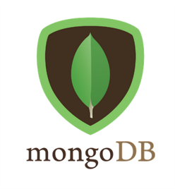

# **Quizzie**
Easy quiz-making app

## **Table of Contents**
* [Introduction](#introduction)
* [Features, present and future](#features)
* [Tech stack](#tech)
* [Insights](#insights)
* [Get started](#getstarted)

<h2 style="font-size: 2rem; font-weight: bold; color:#3A6960">Introduction</h2>

With remote learning now so widespread, it has become more challenging for teachers to assess their students' ability to learn and retain the information presented in class.

Quizzie aims to provide a solution by offering an easy way to create and share flashcard-based quizzes, providing detailed stats to the teacher and instant feedback to the students so gaps in understanding can be corrected on the spot.

The look and behaviour of this project were heavily inspired by the app [Anki](https://apps.ankiweb.net/) and the principles of [spaced repetion](https://en.wikipedia.org/wiki/Spaced_repetition) as a powerful learning tool.

Quizzie was buit by [one person](https://github.com/PLejay) over the course of one week as a [Codeworks](https://codeworks.me/) solo project. As such, it is closer to a first draft than a complete app, with features partially implemented and not fully tested (as of Feb 2021).

<h2 style="font-size: 2rem; font-weight: bold; color:#3A6960">Features</h2>

<h2 style="font-size: 2rem; font-weight: bold; color:#3A6960">Tech Stack</h2>

This app was built with:

-  in the front end

- ,  and   in the back end

-  across the stack

<h2 style="font-size: 2rem; font-weight: bold; color:#3A6960">Get Started</h2>

- Fork the repository and clone it on your local machine
- Install the dependencies by running `npm i` in both client and server directories
- Update the config files with the appropriate ports and database URL
- Build the server by running `npm run build` and start with `npm start`
- Start the client by running `npm start`

Note: this is assuming that you have MongoDB already installed and running on your computer, as well as Node JS and npm. For the database, mock data is available in the 'mock-data' folder in the server.